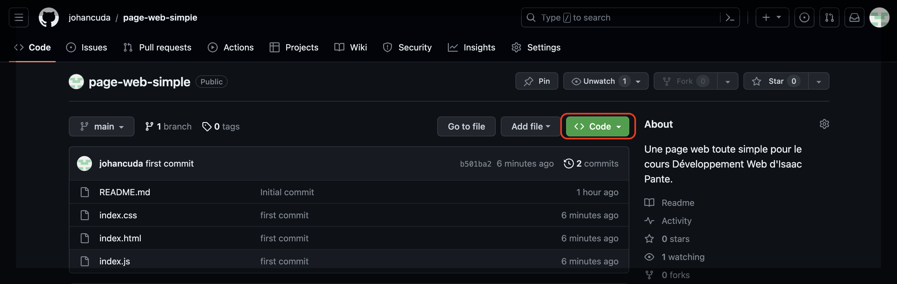
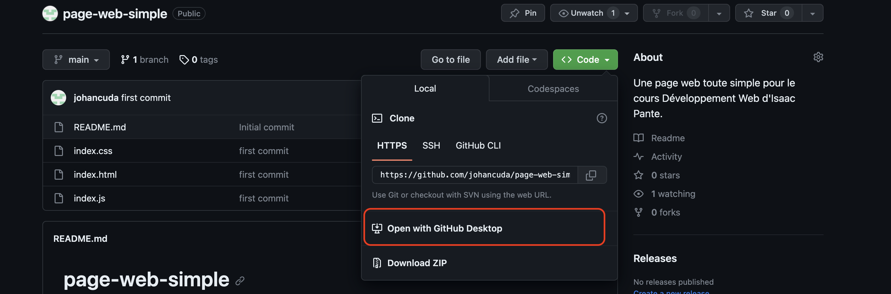
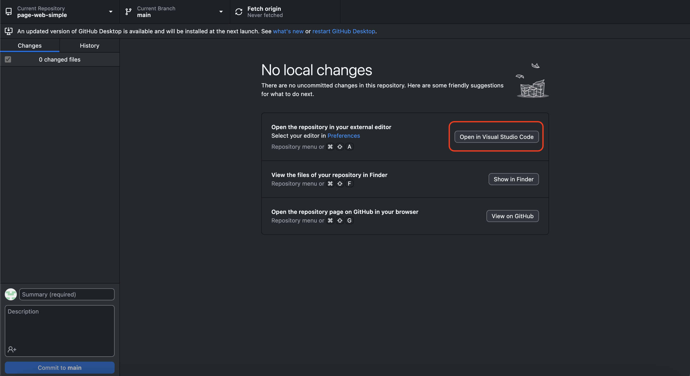
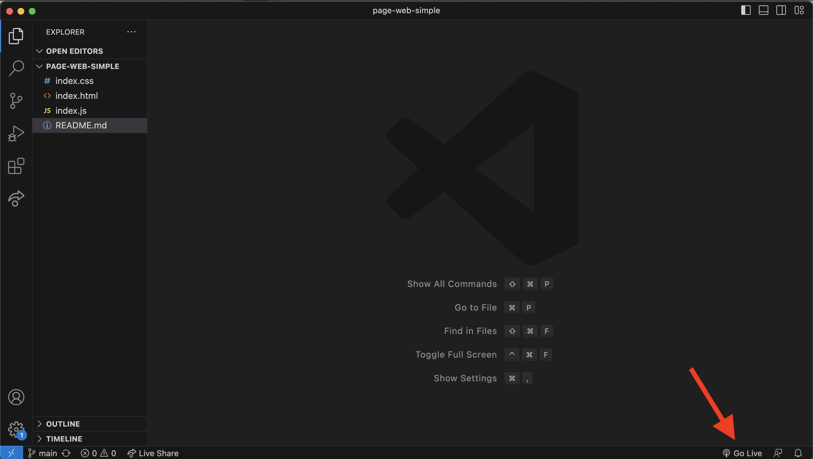

# Une page web simple

## Description

Ce repo contient une page web simple pour illustrer les méchanismes généraux et l'architecture d'un site web. Il est proposé aux étudiants du cours "Développement web" donné par Isaac Pante (Maître d'enseignement et de recherche, SLI, UNIL).

## Utilisation

Pour créer votre copie de ce site sur votre machine (et vous amuser à le modifier):

1. Rendez-vous sur la [page GitHub](https://github.com/johancuda/page-web-simple) de ce projet.

2. Appuyez sur la bouton "code" (en vert) et sélectionnez l'option "Open with GitHub Desktop".

3. Une fois que  GitHub Desktop ce sera ouvert, choisissez dans quel dossier sur votre machine vous voulez cloner le repo.

4. Ouvrez ensuite le dossier dans VS Code.

5. Lancer le server local en appuyant sur le bouton "Go Live" pour visualiser la page web dans votre navigateur.

## Architecture

Ce site contient un partie des mécanismes qui vous serons présentés ce semestre. Nous vous invitons à parcourir l'intégralité du code de cette page web : il contient beaucoup de commentaires et d'indications qui pourraient vous être utiles. Nous essaierons dans la mesure du possible de rajouter d'autre éléments à cette page pendant le semestre pour illustrer les futures concepts qui vous seront présentés dans le cours.

## Contributeur(s)

Mis en place par Johan Cuda (Assistant étudiant, SLI, UNIL).

